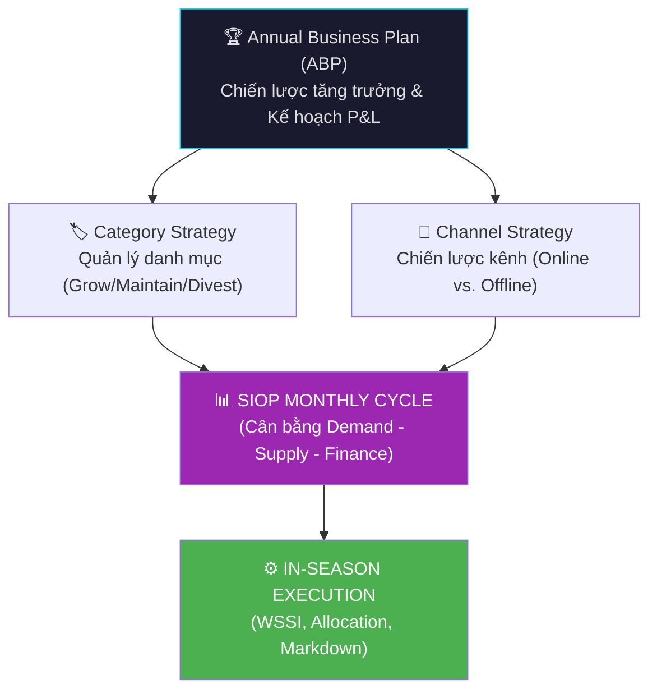
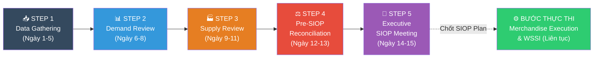

# 📊 Khung SIOP Đa Quốc Gia (MNC Standard SIOP Framework)
## Dành cho Doanh nghiệp Thời trang (Fashion & Apparel)

> [!IMPORTANT]
> Đây là bộ tài liệu chuẩn hoá quy trình SIOP theo mô hình **5-Step Process** (khởi xướng bởi Wallace & Stahl) kết hợp với các tiêu chuẩn của **Oliver Wight Class A**. 
> Quy trình được thiết kế với **Tầm nhìn (Horizon) 18 tháng** để đảm bảo khả năng dự báo dài hạn từ khâu lên ý tưởng BST cho đến lúc ra mắt, quản lý in-season và thanh lý.

---

## 🎯 1. Liên kết Chiến lược (Strategic Alignment)

Khác với quy trình vận hành ngắn hạn, SIOP chuẩn MNC là cây cầu nối trực tiếp giữa Chiến lược Kinh doanh (Business Strategy) và Thực thi Vận hành (Operational Execution).

---

## 🔄 2. Quy trình SIOP 5 Bước Hàng Tháng (The 5-Step Process)

> [!NOTE]
> Quy trình 5 bước đảm bảo việc ra quyết định được thực hiện ở **Cấp độ Danh mục (Category Level)** trong các cuộc họp điều hành, tránh sa đà vào cấp độ SKU chi tiết.

---

## 📂 3. Cấu trúc Tài liệu & Hướng dẫn sử dụng

| Bước | File | Nội dung chính | Owner |
| :---: | :--- | :--- | :--- |
| **1** | **[01-data-gathering.md](file:///C:/Users/Administrator/.gemini/antigravity/scratch/planning-project/siop/01-data-gathering.md)** | Data Master, Cấp bậc sản phẩm (7 Level Hierarchy), Seasonality Index, Forecast Bias | Data Analyst / FP&A |
| **2** | **[02-demand-planning.md](file:///C:/Users/Administrator/.gemini/antigravity/scratch/planning-project/siop/02-demand-planning.md)** | Tầm nhìn 18 tháng, Scenario Planning, NPI Pipeline, Unconstrained Demand | Sales / Marketing |
| **3** | **[03-supply-planning.md](file:///C:/Users/Administrator/.gemini/antigravity/scratch/planning-project/siop/03-supply-planning.md)** | Năng lực cung ứng, OTB Budget, Constrained Demand | Merchandising / SC |
| **4 & 5** | **[04-pre-siop-and-exec-meeting.md](file:///C:/Users/Administrator/.gemini/antigravity/scratch/planning-project/siop/04-pre-siop-and-exec-meeting.md)**| Gap Analysis, Financial Integration, Root Cause Analysis, Biên bản họp | SIOP Manager / CEO |
| **Thực thi** | **[05-execution-and-wssi.md](file:///C:/Users/Administrator/.gemini/antigravity/scratch/planning-project/siop/05-execution-and-wssi.md)**| WSSI Framework, Phân bổ kho (Allocation), Inter-store Transfer, Markdown Strategy | Merchandise Planner |

---

## 👥 4. Ma trận Vai trò (RACI Matrix chuẩn MNCs)

Sự tham gia đa phòng ban (Cross-functional collaboration) là chìa khóa của SIOP. Phải phân định rõ ràng ai là người chịu trách nhiệm cuối cùng (Accountable) cho từng khâu.

| Các bước & Hoạt động chính | SIOP Manager / FP&A | Sales / MKT | Merchandising | Supply Chain | CEO / GM |
| :--- | :---: | :---: | :---: | :---: | :---: |
| **Bước 1: Data Gathering** (Chuẩn hóa data, Baseline Forecast) | **A** | I | I | I | I |
| **Bước 2: Demand Review** (Chốt Unconstrained Demand) | C | **A** | C | I | I |
| **Bước 3: Supply Review** (Xác định khả năng đáp ứng) | C | I | **A** | **R** | I |
| **Bước 4: Pre-SIOP** (Cấn trừ Demand/Supply, Financial Gap) | **A** | **R** | **R** | C | I |
| **Bước 5: Executive Meeting** (Duyệt kịch bản, Quyết định OTB) | **R** | C | C | C | **A** |
| **Thực thi WSSI & Allocation** (Trong mùa) | I | C | **A** | **R** | I |

> **R** = Responsible (Người làm) · **A** = Accountable (Người chịu trách nhiệm cuối) · **C** = Consulted (Người tư vấn/góp ý) · **I** = Informed (Người được nhận thông tin)

---

## 🕰️ 5. Sự khác biệt giữa SIOP Planning & Master Production Schedule (MPS)

Một trong những lỗi lớn nhất làm SIOP thất bại là mang chi tiết từng màu, từng size (Color/Size) vào bàn họp điều hành. Theo chuẩn quốc tế, SIOP và MPS/Execution phải được tách biệt rõ ràng ở mức độ phân cấp (Level of Granularity):

1. **Khối SIOP (Strategic & Tactical)**
   - **Tầm nhìn:** 3 – 18 tháng tới.
   - **Đơn vị lập kế hoạch:** Level 3 (Category) hoặc Level 4 (Sub-category). Ví dụ: Lên kế hoạch cho "Áo sơ mi nam" nói chung.
   - **Quyết định:** Mở xưởng mới không? Tăng ngân sách OTB không? Đầu tư thêm marketing không?

2. **Khối MPS / WSSI Execution (Operational)**
   - **Tầm nhìn:** 0 – 12 tuần tới.
   - **Đơn vị lập kế hoạch:** Level 5 (Style), Level 6 (Color) và Level 7 (SKU/Size).
   - **Quyết định:** Cắt bao nhiêu cái màu Đen size M? Chia về kho A bao nhiêu, kho B bao nhiêu? Mẫu này tuần sau có giảm giá không?
